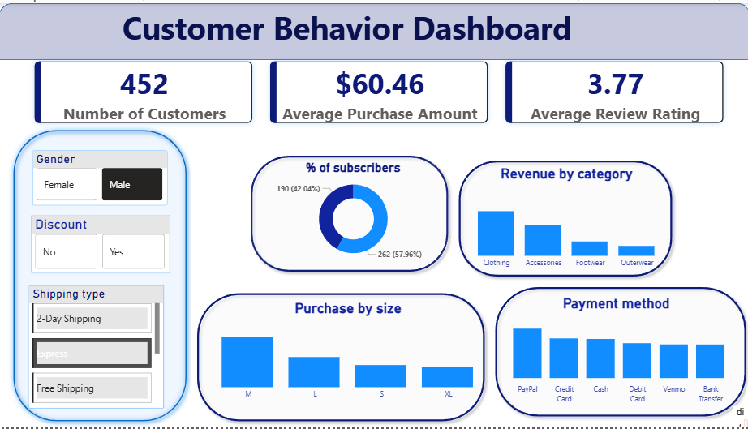

# Customer Behavior SQL Analysis

## Overview
End-to-end analysis of customer shopping behavior using Python, PostgreSQL, SQL, and Power BI. Covers data cleaning, feature engineering, SQL queries, and dashboard visualization.

## Tools
Python (Pandas)  
PostgreSQL  
SQL  
Power BI  

## Workflow
1. Data preprocessing in Python  
2. Feature engineering (age_group, purchase_frequency_days)  
3. Upload to PostgreSQL  
4. Analysis using SQL  
5. Visualization in Power BI  

## Key Insights
- Young adults generate highest revenue  
- Subscribers spend more than non-subscribers  
- Discounts impact purchasing behavior  
- Clothing category leads in revenue  

## Structure
data/  
sql/  
notebooks/  
powerbi/  
images/  

## Dashboard

## Run
1. Clean data in Python  
2. Upload to PostgreSQL  
3. Execute SQL queries  
4. Open Power BI and refresh  

## Future Work
- Predictive modeling  
- Automated pipeline  
- Real-time dashboard
